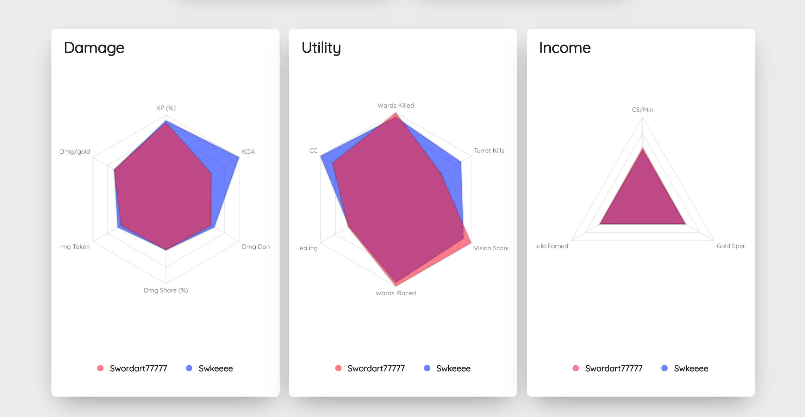

## Basic Web Application Utilizing the Riot Games Developer API
- This application is intended to function both as a resource to view your League of Legends player statistics and as a tool for player improvement. 
The user can break down of their recent matches and identify opportunities for player improvement. 
The application was built using React.js, Material-UI and is hosted through the Google Firebase Platform. 

- All player data used throughout the application was taken through the Riot Games Developer API. 
More information about the API can be found at https://developer.riotgames.com/

## Hosting URL
https://lol-api-project.web.app/

## Usage

### Searching for an account

- Users can search for an account using either the primary search bar located at the website
root or from a user page in the top right corner on the player's account page. 
Currently only North American accounts are supported on the application.

### Summoner Page

- The summoner page represents the display of the user's account. The data that is displayed
on the player's rank, account level, ranked win-rate, wins, losses, their 
top played champions and their five most recently played ranked matches.

### Match Page
- The match page is accessed by clicking the arrow on the right side of a given recent match.
 The match page is a breakdown of that given match displaying the match-up of the player and their corresponding
 lane opponent from that game. The data being displayed showcases the comparison in various different statistical categories
 of the two players. Furthermore, there is a line graph which displays the difference between each players income over
  the course of the game. Every chart on this page was done using Chart.js
 
- This is intended to be the main analytical tool of the application where the player can breakdown the match-up
 and identify potential areas of improvement or where the game went wrong.
 
 
 
 
 
 

## Contributors
- Jackson Schuler (https://github.com/jacksonschuler)
